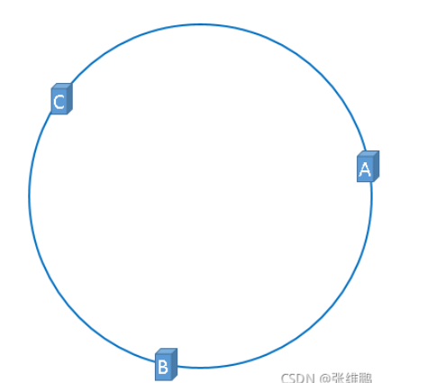

# redis集群的作用
  - redis集群支持多个master,每个master又可以挂载多个slave,从而实现读写分离,数据高可用并且支持海量数据的读写存储操作
  - 由于Cluster自带Sentinel的故障转移机制,内置了高可用的支持,无需再去使用哨兵功能
  - 客户端与redis的节点连接,不再需要连接集群中所有的节点,只需要任意连接集群中的一个可用节点即可
  - 槽位slot负责分配到各个物理服务节点,由对应的集群来负责维护节点、插槽和数据之间的关系

# redis选择哈希槽作为数据分片算法
  - redis集群通过哈希槽来进行数据分片,每个键都被映射到一个特定的哈希槽上,然后这些槽会被分配到不同的redis节点上,实现了数据的分布式存储;
  - 在redis集群中,哈希槽的数量是固定的,通常为16384个,每个redis节点负责管理其中的一部分槽位,当需要扩容或缩减集群时,会动态低重新分配槽位;
  - 数据在集群中的分片是通过键的哈希值来确定的,同一个哈希槽上的键会被存储在同一个节点上,这也可以保证在进行数据操作时,只需要查询对应的节点,而不需要遍历整个集群
  - 通过哈希槽的方式进行数据分片

# redis的分布式存储算法 || redis中slot槽位映射算法 || redis中数据分片算法
  - 哈希取余算法
    比较简单直接,将数据进行hash后对N取余,N为集群中服务器的数量,然后把取余后的结果与每台机器的数据映射范围比对,决定数据存放在哪一台具体的机器上;
    优点就是可以实现亿级数据的负载均衡;缺点也比较明显,就是无论是出现宕机亦或是集群扩容,都会导致数据的取余结果与我们预设的数据映射范围出现不匹配(因为N变了),
  若想匹配需要重新计算数据映射公式,所以在实际开发场景中,这个落地方式并不够好;

  - 一致性哈希算法
    一致性哈希不在对服务器数量进行取模,而是对2的32次方取模,这就可以保证我们得到的哈希值是处在0~2的32次方-1的这个区间内;那么下一步我们要根据服务器的ip或者是
  server-name,总之是一个唯一标识来计算该台服务器的hash,取模后也就可以得到一个区间内的数字,进行标记;现在再制定一个寻址规则,当一个数据想要存入redis时,我们首先
  对其进行hash,取模,得到的结果开始递增寻找第一个服务器的标记点,找到的那个服务器即是该条数据要存入的服务器,那么如果走到尽头2的32次方也没用找到怎么办——从0开始继续
  递增查找!
    上面我是用一个比较干的理论来形容一致性哈希的寻址方式,实际上很多人喜欢用圆来表示周而复始不会断开的这个寻址结构,其实也就是让"0 = 2的32次方"来形成一个首尾相交的圆,
  本质上就是从小到大的找一个标记点,若到头则从零开始继续找;
    优点就是不再需要计算映射公式,受服务器数量变更的影响较小,无论是宕机还是扩容,实际上只有一小部分数据发生了变化;,
  假设我们要在AB之间新增一个H,那么实际上只有A到H这部分数据会转移到H服务器进行存储,其余任何数据都不受影响;而若我们的B宕机,那么也只有A到B相当于1/3的数据存储
  服务器发生了变化,1/3起码比1好多了吧;
    但是一致性hash也有缺点：就是数据倾斜的问题,因为我们并不像hash取余那样计算公式平均分配,我们的服务器点位是hash取模计算出的,一旦我们当前的服务节点过少,或者因个别服务
  宕机而导致的现存节点的分布不均,就有可能造成大量数据集中打在某一台服务器上,而为了解决数据倾斜问题,引入了虚拟节点机制即对服务器进行多次hash,即原来三个服务器有3个标记位,
  引入虚拟节点后三个服务器可以有24个虚拟节点,而每一个虚拟节点都指向着真实节点,这样确实很大程度的避免了数据倾斜问题;但是即使引入了虚拟节点,服务器的标记位也不是均匀分布的,
  也就是数据在存储的时候达不到均匀分布的效果;

  - 哈希槽算法
    这也是目前大多数厂商使用的分布式存储方式,它提出了slot槽的概念,槽下是节点,而数据经过一次哈希和对16384取模后会映射到槽上,再根据该插槽对应的节点决定存入具体的哪一台机器上;
  并且因为我们固定了槽位的范围是0~16383,我们的槽位的取值范围会根据节点的数量进行平均分配,这样就解决了数据倾斜的问题;
    例如我们有一个redis集群包含6个节点,每个节点就会对应一段连续的槽位区间：节点1：0~2730、节点2：2731~5460、节点3:5461~8191、节点4：8192~10922、节点5:10923~13653、
  节点6：13654~16383,这样就解决了数据倾斜的问题;
    并且哈希槽的模式下如何新增节点就会在现有的每一个插槽中取出等同的一部分给新的节点形成一个新的插槽,该插槽最终的容量跟其他插槽相同;删除插槽的时候同样,会将自己所拥有的槽位区间
  等分给其他插槽;例如: 
      - 原本三个节点:    节点A  0－5460    节点B  5461－10922  节点C  10923－16383  
      - 新增一个节点后:  节点A  1365-5460  节点B  6827-10922   节点C  12288-16383   节点D  0-1364,5461-6826,10923-12287
    需要注意,redis在进行主从集群部署时,只根据master节点进行槽位分配,slave节点没有槽位

# 经典面试题————为什么redis集群的最大槽数是16384
  CRC16算法产生的hash值有16bit,即该算法可以产生2^16=65536个值
  换句话说,值是分布在0~65535之间,那为什么又更大的65536不用,而选择2^14,16384呢？
  - 第一,redis底层是用C写的,在集群中,每秒钟redis节点需要发送一定数量的ping消息作为心跳包,这个ping包主要的空间消耗来自myslots字段,而该字段是一个数组,其大小为CLUSTER_SLOT/8,
  那如果槽位为65536,这个字段将是65536/8/1024=8kb,进一步说这个心跳包的ping消息的消息头达到8kb,确实太大了,而如果是16384,则心跳包的消息头只要2kb;
  - 第二,集群节点越多,心跳包的消息体内携带的数据越多,如果节点超过1000个,也会导致网络拥堵;因此redis作者不建议redis cluster节点数量超过1000个;那么,对于节点数在1000以内的redis
  集群,16384个槽位够用了,没必要拓展到65536;
  - 第三,也是最重要的一点,Redis集群中各个主节点的所负责的哈希槽的槽位信息是通过bitmap保存的,每个主节点维护各自的bitmap,那么当我们查一条数据时,需要根据key进行一次哈希,看其属于哪个
  哈希槽,再通过位图查找该哈希值是否在自己维护的位图上,如果没有就会向其他主节点索要其位图,位图会压缩传递过来,在逐一位图进行判断,最终确定数据存在哪个节点;那在这个过程中,多个节点之间通信时
  位图要进行压缩传输,那65535更多的数据,压缩传输的性能损耗也就越多了;那么在16384个插槽已经可以满足要求的情况下,也就没必要非图大,使用65535;
  - 总结,就是16384完全够用了

# redis集群不保证强一致性
  这意味着在特定的条件下,redis集群可能会丢掉一些被系统收到的写入请求命令,即在CAP原则中,redis集群只能保证AP;
  这个场景也很简单,就是在三主三从的redis集群中,一台master完成一次写操作后,还未同步给slave节点就宕机,那slave节点晋升为master后,就会发生数据不一致的问题;

