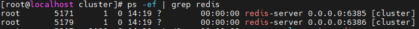

# redis主从集群实操
  本次依然采用三台机器模拟三主三从集群的方案,在一台虚拟机上会启一个master节点和一个slave节点进行模拟
  
# 主从集群搭建————1.配置文件修改
  [执行命令, vim /myredis/cluster/redisCluster6381.conf](/file/redisCluster6381.conf)
  分别创建6个类似的配置文件于三台虚拟机上,配置文件中仅需修改端口
  
# 主从集群搭建————2.启动服务,配置集群
  - 启动服务 redis-server /myredis/cluster/redisCluster6381.conf
  - 检察服务 ps -ef | grep redis, 检查进程可以发现,当前的redis服务是以集群模式启动的
  - 构建主从关系命令
    redis-cli -a 1234567a --cluster create --cluster-replicas 1 192.168.10.132:6381 192.168.10.132:6382 192.168.10.134:6383 192.168.10.134:6384 192.168.10.135:6385 192.168.10.135:6386
  - 以6381作为切入点,查看并检验集群状态
    - 这个命令可以更清晰的显示集群中节点之间的关系: cluster nodes
    - 这个命令可以查看当前节点在集群中的状态和角色: info replication
  - 至此,集群搭建完成

# 主从集群测试
  - 读写测试
    命令进入redis: redis-cli -a 1234567a -p 6381 -c
    相比于我们的单机版,当想要使用集群的redis服务时,需要加上-c,才可以正常的读写,否则会因为数据key的路由问题而出现部分key读写error的问题(不同key可能会路由到不同的槽位,也就是不同的机器);
  - 集群容错
    手动关闭6381端口的服务,发现其slave6384会上位成为新的master,继续提供服务
    重启6381服务加入后,发现6381将作为6384的slave,master仍为6384,存在于集群中;即并不会出现原有master宕机后重新加入依然是master的情况,宕机了,slave节点就会顶上,等再回来时只能是slave节点;
  - 手动触发故障转移
    手动触发故障转移: cluster failover ,此时,6381将重新成为master,而刚刚因为6381宕机顶替上来的6384将重新成为slave
    解释一下这个命令: 通常发生主从节点的互换的原因都是因为主节点宕机,从节点才顶上,而该命令的意义就是手动触发故障转移,即手动可以触发一次主节点宕机,那么就会出现主从节点的身份发生对调的情况,其实该命令
  有点类似瞬间触发主节点宕机 -> 从节点成为主节点 -> 主节点重启加入集群成为从节点这样一个过程;

# 主从集群扩容
  - 引入6387,6388;配置conf文件,启动服务
  - 将新增的6387节点作为master节点加入集群,命令: redis-cli -a 1234567a --cluster add-node 192.168.10.134:6387 192.168.10.132:6381
    6381相当于原集群中的引路人,通过6381从而找到组织加入集群
  - 此时6387虽然已作为master节点加入集群,但未分配槽位;
  - 分配槽位,命令: redis-cli -a 1234567a --cluster reshard 192.168.10.132:6381
    [redis交互,How many slots do you want to move (from 1 to 16384)?] 4096, 因为此时算是6387共4台主机平分16384个插槽,所以16384/4=4096
    [redis交互,What is the receiving node ID?]  e5a6cc0208072a6cc64fc845a49e554658e5ca44, 该id可通过cluster nodes,查找到6387服务对应的id;
    分配完成后重新查看集群信息即可发现6387被分配的槽位是: 0-1364 5461-6826 10923-12287,因为重新分配成本太高,尤其是考虑到一些插槽里还可能存了数据,所以由之前的三个master各自拿出一部分槽位给6387
  - 为新的主节点6387分配slave
    redis-cli -a 1234567a --cluster add-node 192.168.10.134:6388 192.168.10.134:6387 --cluster-slave --cluster-master-id e5a6cc0208072a6cc64fc845a49e554658e5ca44
                                                                 引路人ip                                                 跟随的主节点的服务id,可在cluster nodes中进行查看
# 主从集群缩容
  - 先清除从节点6388
    命令: redis-cli -a 1234567a --cluster del-node 192.168.10.134:6388 be77020c93d218f6ed27e54170539f2c40386d10 ,最后这个是6388的服务id
  - 将主节点6387的槽号清空,清出来的槽号全部都分配给一台机器6381
    重新分配槽位命令:redis-cli -a 1234567a --cluster reshard 192.168.10.132:6381
    [redis交互,How many slots do you want to move (from 1 to 16384)?] 4096, 因为目前6387一共有4096个槽位
    [redis交互,What is the receiving node ID?] b8af193e5aa177c0451a7ab503738698ffcdaa91,6381的服务id
    [Please enter all the source node IDs.] 因为当前我们的接受id已经分配槽位了,所以redis意识到我们当前是要缩容,所以接下来我们要填槽位来源
    [Source node #1:] e5a6cc0208072a6cc64fc845a49e554658e5ca44, 这是6387的服务id,也是槽位来源
    [Source node #2:] done, 这里done表示所有6387的槽位都给我们上面receiving node ID处选择的6381,而all表示等分给集群里的所有master节点;
    至此完成6387节点槽位的释放,此时6387依然存在于集群中,但被降级为slave节点,会作为一个master节点的slave节点存爱,当然之前分配的槽位也已经被清空
  - 删除主节点6387
    命令: redis-cli -a 1234567a --cluster del-node 192.168.10.134:6387 e5a6cc0208072a6cc64fc845a49e554658e5ca44 ,最后这个是6387的服务id
    至此,集群恢复成三主三从

# redis集群分片小总结
  - 在redis集群环境中,因为每个key可能会分在不同的槽位,即不同的机器上,那这时,在使用mget、mset等批处理命令可能会出现问题,不在同一个slot槽位下的键值无法使用mset、mget等多键操作;
  但是可以通过通识占位符{}来定义同一个组的概念,是key中{}内相同内容的键值对放到一个slot槽位中去,例如:mset nba1{z} jokic nba2{z} giannis nba3{z} donicic,就可以将多个键
  nba1、nba2、nba3在计算槽位时,统一通过{}中的z来计算,确保多个key可以存放到相同的slot,取的时候也需要: mget nba1{z} nba2{z} nba3{z},基于此可以确保mset、mget命令的可用;
  - 常用命令
    - cluster-require-full-coverage,表示集群是否完整才能对外提供服务,默认yes;
      现在集群架构是三主三从的redis cluster由3个master平分16384个slot,每个master的小集群负责1/3slot,对应一部分数据;cluster-require-full-coverage,默认值为yes表示,
    需要集群完整性,方可对外提供服务;如果这三个小集群中,任何一个一主一从挂了,你这个集群对外可提供的数据只有2/3了,整个集群是不完整的,redis默认在这种情况下,是不会对外提供服务的;
    如果你希望在集群不完整的情况下也可以对外提供服务,需要将该参数设置为no,这样的话你挂了的那个小集群时不行了,但是其他小集群仍可以对外提供服务;
    - cluster countkeysinslot 12706, 检查12706这个槽位被分配了几个key,返回值是几表示该槽位被分配了几个key;
    - cluster keyslot z, 计算z这个key应该存放在哪个槽位;