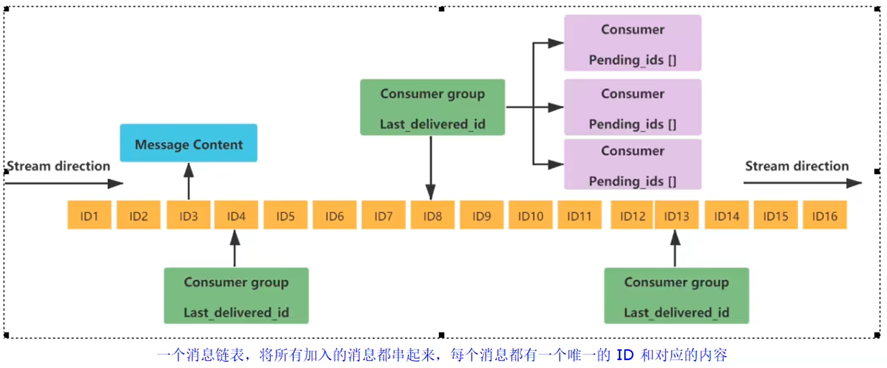

# bitmap 位图
  由0和1状态表现的二进制位的bit数组
  - setbit bitmap1 1 1, 设置索引1的值为1
    setbit bitmap1 7 1, 设置索引7的值为1
  - get bitmap1, 因为底层是数组,所以可以用String的命令获取,因为当前的值是01000001,换算成10进制是65,再通过ASCII码得到结果是'A';
  - strlen bigmap1, 这个命令的结果并不是bigmap的数组长度,而是当前的bitmap占据的字节数,8个byte位一字节,所以向我们上面给bitmap的1和7设置为1,那么strlen bigmap1命令的结果就是1,
                    若我们setbit bitmap1 20 1,那执行strlen bigmap1的结果就是3,因为3个字节对应的数组索引范围是0~23;
  - bigcount bigmap1, 查询全部键中值为1的键的个数;
    加入现在bigmap1[0,0,0,0,1,0,1,0,1,1]
    bitcount bigmap1 0 1 bit,表示以bit为单位,检索索引为0的bit位到索引为1bit位之间值为1的元素个数,结果为0
    bitcount bigmap1 0 1 byte,表示以byte即8个bit为单位,检索索引为0的bit位到索引为8bit位之间值为1的元素个数,结果为4
    
  - bitop bitmap1[1,1,1],bitmap2[0,0,1];
    bitop and temp bitmap1 bitmap2, 表示对bitmap1和bitmap2的每一个索引值做按位与运算,将结果为1的索引存入temp的相同索引位置处,结果应该是将索引2值为1这个结果存入temp,即temp会变为[0,0,1];
    bitop or temp bitmap1 bitmap2, 表示对bitmap1和bitmap2的每一个索引值做或运算,将结果存入temp的相同索引位置处,结果应该是将索引0,1,2及值均为1的结果存入temp,即temp会变为[1,1,1];
    bitop xor temp bitmap1 bitmap2, 表示对bitmap1和bitmap2的每一个索引值做按位异或,将结果存入temp的相同索引位置处,所以结果temp应该是temp[1,1,0]
    bitop not temp bitmap1, 表示会把bitmap1中对应索引位置上值为1的索引,存入temp,并将其值设为0,并在将一个字节内的其他索引位置的值设为1,目前bitmap1[1,1,1],所以temp前三位都为0,[0,0,0],并且
                            会将一个字节内的其他位改为1,所以temp[0,0,0,1,1,1,1,1];

  - 应用场景: 比如记录一个用户一年365天的签到情况,
    - setbit user_id 0 1, 第一天来了;
    - setbit user_id 1 0, 第二天没来
      以此类推可以轻松的计算一个用户的一年签到情况;

# hyperLogLog 基数统计
  去重复统计功能的基数估计算法,就是HyperLogLog,但是这个是一个估计算法,官网中给出会有0.81%的误差;
  hyperloglog只会根据输入元素来计算基数,而不会存储元素本身,所以不能像集合那样,返回输入的各个元素;
  - pfadd hyper1 ww, 插入元素;
  - pfcount hyper1, 返回hyper1的基数;
  - pfmerge hyper1 hyper2, 表示将hyper2内的元素合并去重进hyper1中;
    pfmerge hyper3 hyper1 hyper2, 表示将hyper1和hyper2内的元素合并去重进hyper3中;

  - 应用场景
    - 统计某个网站的UV、统计某个文章的UV(Unique Visitor,独立访客,一般理解为客户端IP)
    - 用户搜索网站关键词的数量
    - 统计用户每天搜索不同词条个数
  - 应用场景编码实战案例见高级篇

# GEO 地理空间
  geo的类型实际上是个zset;
  - geoadd city 120.123 30.985 qiqihar, 标识创建一个key为city的geo,并添加其经纬度和value;
    geoadd city 116.123 35.123 new_york 120.456 30.456 jazz 90.987 32.987 LA,  一次可以添加多个;
  - geopos city new_york, 返回经纬度,结果为: 120.456, 30.456
    geopos city new_york jazz, 可以一次返回多个value的经纬度;
  - geohash city new_york, 返回经纬度的hash值,这个主要是把二维数据转为一维数据,方便存储;
  - geodist city new_york jazz m/km/ft/mi, 计算一个key中两个value之间的距离,单位 米/千米/英尺/英里
    这个命令只支持相同key的value之间计算距离,不同key的value无法相互比较;
  - georadius city 116.418 39.911 10 km withdist withcoord withhash count 10 desc
    表示返回k以给定经纬度为中心,求出key中距离该中心店10km以内的所有value;
    - withdist: 表示再返回元素的同时,将位置元素与中心之间的距离也一并返回,距离的单位和用户给定的范围单位保持一致;
    - withcoord: 将位置元素的经度和纬度也一并返回
    - withhash: 返回位置元素经过geohash编码后的值
    - count: 限定返回的记录数
    - asc: 返回结果按照距中心点距离排序,离得越近越靠前
    - desc: 返回结果按照距中心点距离排序,离得越远越靠前
    最简单的写法: georadius city 116.418 93.911 10 km
  - georadiusbymember city new_york 1000 km, 表示以new_york为中心,找出city这个key中,跟中心距离10km以内的其他value,该命令也可以跟随georadius后面的一系列参数

  - 应用场景编码实战见高级篇,但其实可以发现这个就是会用在地图、定位这些需求上;

# Stream 流
  redis的stream,就是redis版本的mq消息中间件+阻塞队列
  
  涉及stream结构,有多个概念:
  - message content: 消息内容,结构类似hash结构,以k-v键值对的形式存在;
  - consumer group: 消费者组,通过XGROUP CREATE命令创建,同一个消费组可以有多个消费者
  - Last_delivered_id: 游标,每个消费者组都有自己的游标,消费者读取了消息就会使游标往前移动
  - consumer: 消费者
  - pending_ids: 每个消费者组都有自己的pending_ids,用来存放当前消费者已读取但未ack的消息id,如果客户端没有ack,pending_ids中的消息id就会越来越多,
                 一旦某个消息被ack,它就开始减少;它用于确保客户端至少消费了消息一次,而不会在网络传输的中途丢失;

  - 队列相关指令
    - xadd: 添加消息到队列末尾,该命令有三个注意点: 1)消息id必须要比上个id大 2)默认用星号表示自动生成规矩 3)* 用于xadd命令中,让系统自动生成id
      xadd line * nba giannis, 表示向队列line中添加键值对<nba, giannis>,id则由系统自动生成;如果line队列不存在,则直接创建;
      xadd line * id 15 nba anthony, 表示向队列line中添加键值对<id, 15>和<nba, anthony>
        这里非常需要注意的一点是,这是stream,上面两条记录是两条消息,所以他们之间其实没有任何关系,即使键值对的key相同,也没任何关系,当前stream底层list中就是两条消息,
      第一条是<nba, giannis>,第二条是<nba, anthony>  
      xadd line 1954033414836-0 type uu, 表示向队列line中添加键值对<type, uu>,并手动设置id为:1954033414836-0
        首先就是我们消息的ID的结构是时间戳-序号,而这里尤为重要的是前面的时间戳,就比如现在我们刚向line中插入一条数据,那么下一次如果要指定ID,ID必须大于1954033414836,才可以成功插入或者时间戳相同,
      后面序号大于前一个ID的后面序号,即我们在插入一条ID为1954033414836-1的数据也是可以的;但需要注意,如果指定的 时间戳-序号,跟现有数据的完全一致,这种情况也是无法插入的;
    - xrange line - +, 表示根据ID由小到大展示stream中所有消息,不支持xrange line + -这种写法,若想倒排,需要使用xrevrange;
      xrange line - + count 1, count表示限制返回的个数,当前就是只会返回一条消息
    - xrevrange line + -,表示根据ID由大到小展示stream中所有消息
    - xdel line 1954033414836-0, 根据ID删除line中的消息
    - xtrim line maxlen 2, 表示会截取line中所有消息中ID最长的两条消息,存入line,即其他消息会被删除,只剩截取到的两条,虽然概念是最长ID,但实际上也是最大的ID;
      xtrim line minid 1954033414836-0, 表示消息ID比minid小的消息将会被抛弃,minid本身不会被抛弃;
    - xread, 可以通过阻塞/非阻塞方式读取消息;
      - xread count 2 streams line 0-0, count表示限制返回消息条数,count可以不写;streams是关键字,必须写;0-0表示从当前队列最小ID开始获取stream中的消息;
      - xread block 0 streams line $, 表示从当前队列最大ID开始获取stream中的消息,看着很蠢是吧,都最大了,哪里还有消息? 但是如果这个命令是阻塞的,其实类似于监听器,一旦有新的消息被放进队列中,'
                                      立刻就能监听到;这里block 0,block表示阻塞获取消息,0的位置代表的是时间,单位毫秒,而0表示永远阻塞;
      
  - 消费组相关指令
    - 创建消费者组 xgroup create:
      xgroup create line groupX $; $表示从stream流的尾部开始消费,这个从队尾消费指的不是从后往前消费,而是只会消费更新的消息,类似阻塞队列那里,只会消费大于最大ID的消息,即新来的消息; 
      xgroup create line groupA 0; 0表示从stream流的头部开始消费
      xgroup create line groupC 1714267637619-0; 表示从指定ID的下一条消息,开始进行消费;
    - xreadgroup group
      xreadgroup group groupC consumer1 count 1 streams line > ; streams是关键字, >表示从从第一条尚未被消费的数据开始消费, count表示只消费一条数据
      队列中的消息可以被多个消费组消费,互不影响,但是同一个消费组内,一旦有一个消费者消费数据了,该条记录就不会被组内其他消费者二次消费了,即同一个消费组内的消费者不能消费同一条消息;
    - 消费者组的目的
        目的是让组内的多个消费者共同分担读取消息,所以我们通常会让每个消费者读取部分消息,从而实现消息读取负载在多个消费者间是均衡分布的;
    - 基于stream的消息队列,如何保证消费者在发生故障或宕机再次重启后,仍然可以读取未处理完的消息?
    答:
      - stream会自动使用内部队列(pending list)留存消费组里每个消费者读取的消息,直到消费者使用xack命令通知stream消息已经处理完成;
      - 消费确认增加了消息的可靠性,一般在业务处理完成之后,需要执行xack命令确认消息已经被消费完成;
    - xpending line groupA, 查询groupA中消费但未确认的数据;
      xpending line groupA - + 10 consumer3,表示获取10条consumer3消费者的待确认消息列表
    - xack line groupA 1714267625458-0, 通知line中的groupA,该id的消息已经确认消费完成,执行完这条命令以后,在pending队列中就会将该id的消息移除,针对该id消息的一次完成消费就完成了;

# BitField 位域 [了解即可]
  - 用途:
      BitField命令的作用在于它能够将很多小的整数储存到一个长度较大的位图中,又或者将一个非常庞大的键分割为多个较小的键来进行储存,从而非常高效地使用内存,使得redis能够得到更多不同的应用————
    特别是在实时分析领域,BitField能够以指定的方式对计算溢出进行控制的能力,使得它可以被应用于这一领域;  
  - set fieldkey hello, hello换算成二进制是: 01101000 01100101 01101100 01101100 01101111
  - bitfield fieldkey get i8 0, i表示有符号,u表示无符号,0表示从第0位开始获取,i8则表示获取前8位,即从0开始获取hello的二进制前8位,即01101000,换算为十进制即104,即h;
    bitfield fieldkey get i8 8, 表示从索引8开始,获取hello二进制的8位,即01100101,换算为十进制即101,即e;
    bitfield fieldkey set i8 8 120, 表示从索引8开始的8位二进制位替换为120的二进制,相当于把01100101替换为01111000;

