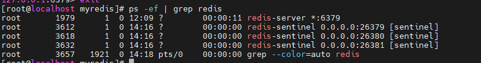

# 什么是哨兵
  吹哨人巡查监控后台master主机是否故障,如果故障了根据投票数自动将某一个从库转换为新主库,继续对外服务;
  通过哨兵就可以实现"运维自动化",当master宕机时,能自动将slave切换成新master
  
# 哨兵能干嘛
  - 主从监控: 监控主从redis库运行是否正常
  - 消息通知: 哨兵可以将故障转移的结果发送到客户端
  - 故障转移: 如果master异常,则会进行主从切换,将其中一个slave作为新master
  - 配置中心: 客户端通过连接哨兵来获得当前redis服务的主节点地址

# 哨兵实操架构说明
  - 三个哨兵  自动监控和维护集群,不存放数据,只是吹哨人;一主二从  用于数据读取和存放
    目前我们已通过三台虚拟机实现一主二从的主从复制架构,但如果引入三台哨兵,那么就需要6台虚拟机,压力过大,所以选择在master机器上开三个哨兵服务来模拟哨兵集群,
  通过不同的哨兵配置文件,实现一台机器启动三个哨兵服务,最终实现一主二从+三哨兵的整体架构;
  - 修改sentinel.conf文件
    sentinel.conf文件内容:(不同的哨兵服务只需要通过修改端口的方式实现)
    bind 0.0.0.0
    daemonize yes
    protected-mode no
    port 26379
    logfile "/myredis/sentinel26379.log"
    pidfile /var/run/redis-sentinel26379.pid
    dir /myredis
    sentinel monitor master_hostname 192.168.10.132 6379 2
    sentinel auth-pass master_hostname 1234567a    
  - 修改redis6379.conf文件;
      此外还要修改master主机上的redis6379.conf,要增加一个配置: masterauth 1234567a,这是因为之后可能出现主机宕机,从机升级为主机,原来的主机恢复后加入集群作为从机,这样一个情况,
    所以,为了以后自己作为从机时也可以和主机正常通信,这里也需要增加配置masterauth;
  - 启动sentinel服务
    redis-sentinel sentinel26379.conf --sentinel
    redis-sentinel sentinel26380.conf --sentinel
    redis-sentinel sentinel26381.conf --sentinel
  - 查看主机上的服务,ps -ef | grep redis
    
  - 关闭主机上的redis服务
    到这为止,目前是出现了问题,没有实现自动将slave升级,经过几轮测试依然没有实现,实操部分就暂时先这样了;

# 哨兵模式的几个小问题
  - 主机宕机后,两台从机是否ok?
    完全ok,并且会选出一个作为新的master
  - 之前宕机的master重启后加入集群,还是master节点吗,是否会有双master的情况？
    不会,在加入进来就是一个slave节点了

# 哨兵运行流程和选举原理(面试重点)
  - 主观下线(SDOWN)
      指的是单个哨兵节点如果发送了ping心跳后,在一定时间内没有收到合法的回复,就达到了SDOWN的条件,也就是该哨兵节点主观上认为master不可用;
    sentinel配置文件中的 down-after-milliseconds设置了哨兵节点判断主观下线的时间长度,默认是30s
  - 客观下线(ODOWN)
      客观下线需要一定数量的sentinel,多个哨兵达成一致意见才能认为一个master客观上已经下线;具体需要几个哨兵达成意见,是根据conf中
    sentinel monitor master_hostname 192.168.10.132 6379 2,配置中的末尾quorum来控制的,当前就是2,该参数的意义是:法定人数/法定票数,意思是
    至少有quorum个sentinel认为这个master主管下线,才会认为这个master客观下线,也只有master客观下线后,才会对这个master进行下线和故障转移,因为有时候,
    某个sentinel节点可能因为自身网络原因导致无法连接master,而此时master并没有出现故障,所以这就需要多个sentinel都一致认为该master有问题,才可以进行
    下一步操作,这就保证了公平性和可用性;
  - 选举领导者哨兵
      当主节点被判断客观下线以后,各个哨兵节点会进行协商,先选举出一个领导者哨兵节点,并由该领导者节点进行redis主节点的故障迁移
      通过raft算法选举出领导者哨兵节点,raft算法的实现原理见(/java_interview/)
  - 由领导者哨兵推动故障切换流程,并选出一个新的master(面试重点)
    - 选举出新master
        在剩余slave节点都健康的前提下,选出新master的规则是依次比较slave节点的priority、复制数据的偏移量和runid
        - priority一般是配在conf文件下,一般也不会特意更改,默认是 replica-priority 100,该数字越小,优先级越高
        - 复制数据的偏移量offset,就是看数据的新旧程度,数据越新,offset越大,相对来说同步起来的成本越低,
        - 按照runID,runID更小的从节点会更优先被选为master
        选出新master以后,sentinel leader会对选举出的新master节点执行slaveof no one操作,使其提升为master节点
    - 需要通知其他slave节点,已经有了新master
        sentinel leader会向其他slave发送命令,让剩余的slave成为新的master节点的slave
    - 在此之后,有新节点加入,这种情况也包括了之前宕机的master节点再次回归
        sentinel leader也会对他执行slaveof ip port的命令,使其成为当前master节点的slave

# 哨兵使用建议
  - 哨兵节点的数量应该为多个,哨兵本身应该集群,保证高可用
  - 哨兵节点的数量应该是奇数
  - 各个哨兵节点的配置应一致
  - 如果哨兵节点部署在docker等容器里面,尤其要注意端口的正确映射
  - 哨兵集群+主从复制,并不能保证数据零丢失,并且在master宕机,哨兵选举这个过程是要消耗一定量时间的,而这个时间内可能依然有大量写请求打到redis,但是此时
  redis是没法对外提供写服务的,直到选举新master完成,那在这个时间内的数据就丢失了或者说这部分数据没有存到redis里,那之后再有读请求就会打到mysql上,这也
  一定程度了增加了mysql的负担,这就是哨兵+主从复制架构的局限性,这也是为什么我们要进一步学习redis集群,现在真正的工作中,哨兵+主从的架构比较少,还是直接上
  集群的占大多数;

