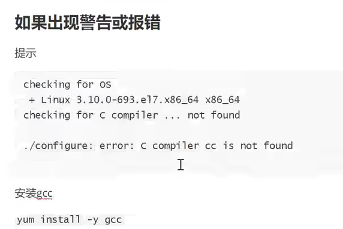
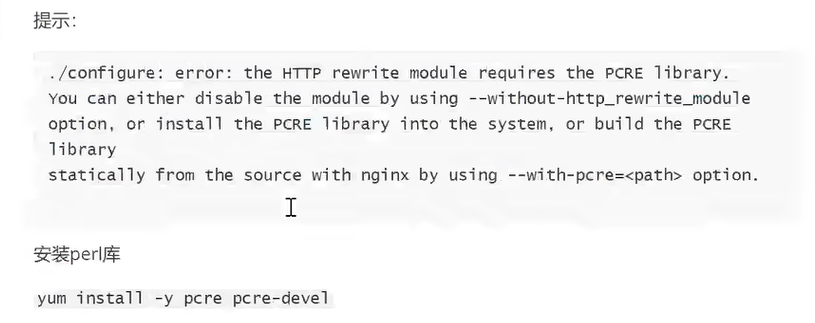
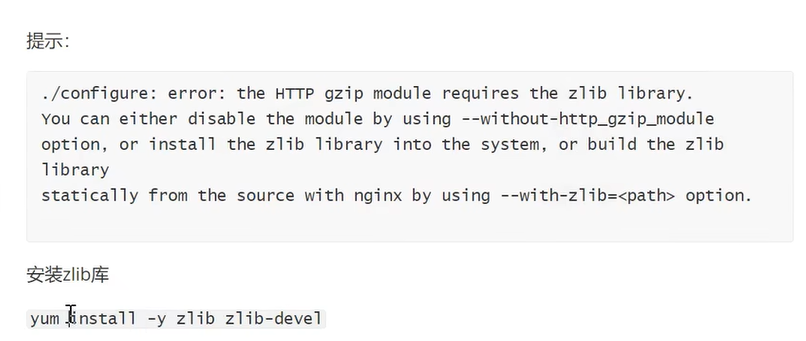

# 为什么需要引入nginx
  因为我们在本地启两个服务,一个7777端口一个8888端口,不通过nginx代理的话,我们没法模拟真实的分布式场景的接口调用
  
# nginx实现接口代理的步骤
  - [nginx解压包](/file/nginx-1.26.1.tar.gz)
  - 解压: [ tar zxvf nginx-1.26.1.tar.gz ]
  - 进入解压后的文件 [ cd nginx-1.26.1 ]
  - 安装 [ ./configure --prefix=/usr/local/nginx ] 后面是nginx的安装目录,请严格遵守该目录 
    安装过程可能会有多种报错:
    - 
    - 
    - 
  - 执行命令 [ make ] , 至此nginx安装完成
  - 配置代理相关的信息,进入目录 [ /usr/local/nginx/conf ],然后修改nginx.conf文件 [vim nginx.conf]
    [最终修改成该文件样式](/file/nginx.conf)
  - 启动nginx,进入[ /usr/local/nginx/sbin ]目录, [ ./nginx ] 即可启动
    [ ./nginx -s stop ] 表示快速停止
    [ ./nginx -s quit ] 表示优雅关闭
    但我们这里因为已经修改了nginx.conf文件,所以启动时需要跟redis一样,指定要加载的配置文件,[ ./nginx -c /usr/local/nginx/conf/nginx.conf ]
  - 此时在访问我们windows的接口就可以通过nginx代理实现,即 [ http://192.168.10.136/inventory/sale ]即可访问到我们的本地接口;
