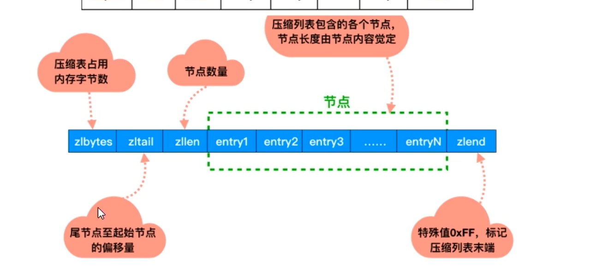

# Hash数据结构介绍
  - redis6: hashtable + ziplist
  - redis7: hashtable + listpack

# redis6数据底层存储方式原理
  两个重要参数,通过命令: config get hash* ,可以拿到两个配置
  - hash-max-ziplist-entries: 使用zipList为编码格式时,哈希集合中最大的元素个数,默认512
  - hash-max-ziplist-value: 使用zipList为编码格式时,哈希集合中单个元素的最大长度,默认64byte(一个英文字母一个字节)

  Hash类型的键的字段个数小于'hash-max-ziplist-entries'并且每个字段名和字段值的长度小于'hash-max-ziplist-value'时,该键的编码格式为压缩列表,
前述任何一个条件不满足则该键的编码方式为hash
  比如 hset nba bucks 1 lakers 2 net 3, 这里键的个数就是3,字段名和字段值的最大长度是6,均满足配置要求,所以该键的编码格式为zipList;
  zipList可以升级到hashtable,反过来降级不可以;一旦从压缩列表转为了哈希,Hash类型就会一直用哈希表进行保存而不会再转为压缩列表了;在节省空间方面,压缩列表更为高效;

# redis7数据底层存储方式原理
  与redis6一致,只不过因为redis7中用listpack取代了zipList,所以参数的也相应的发生了变化,都变成了listpack,至于参数默认值和判断逻辑,均与redis6一致;
  
# OBJ_ENCODING_HT编码格式的底层数据结构
  在redis中,OBJ_ENCODING_HT被称为字典(dictionary),它是一个数组+链表的结构;
  在redis内部,从OBJ_ENCODING_HT类型到底层真正的散列表数据结构是一层层嵌套下去的
  OBJ_ENCODING_HT -> dict(字典) -> dictht(哈希表) -> dictEntry(哈希节点)
  
# zipList
  zipList压缩列表式一种紧凑编码格式,总体思想是多花时间来换取节约空间,即以部分读写性能为代价,来换取极高的内存空间利用率,因此只会用于字段个数少,且字段值也较小的场景;
  压缩列表内存利用率极高与其连续内存的特性是紧密相关的;
  
  zipList是一个经过特殊编码的双向链表,它不存储指向前一个链表节点的prev,也不存储指向下一个链表节点的next,而是存储上一个节点长度和当前节点长度,通过牺牲部分读写性能,
来换取高效的内存空间利用率,节约内存;
  zipList的数据结构如下:() 
  [zlbytes][zltail][zllen][entry1][entry2][entry3][......][entryN][zlend]
  - zlbytes: 记录了整个压缩列表占用的字节数,在对压缩列表进行内存重分配或者计算zlend的位置时使用
  - zltail: 记录压缩列表表尾节点距离压缩列表的起始地址有多少字节: 通过这个偏移量,程序无须遍历整个压缩列表就可以确定表尾节点的地址
  - zllen: 记录压缩列表包含的节点(redisObject)数量,当这个值小于65535时,这个值就是压缩列表内节点的数量,但当这个值等于65535时,节点的真实数量需要遍历整个压缩列表才能计算得出
  - entry1~N: 实际上存的是一个zlentry的数据结构,代表存放在压缩列表的编码类型为zipList的多个value,也可以说是多个redisObject,具体每一个的长度由其内容决定
  - zlend: 特殊值0xFF,标记压缩列表末端

  # zlentry的数据结构(下面代码是redis的c语言源码)
    typedef struct zlentry {
      unsigned int prevrawlensize; // 上一个链表节点占用的长度
      unsigned int provrawlen;  // 存储上一个链表节点的长度数值所需要的字节数,如果上一个节点的长度<254字节,那么provrawlen需要使用1个字节的空间来保存这个长度值,如果前一个节点的长度大于254.那么需要使用5个字节的空间来保存这个长度值
      unsigned int lensize; // 存储当前链表节点长度数值所需要的字节数
      unsigned int len; // 当前链表节点占用的长度
      unsigned int headersize; //当前链表节点的头部大小(prevrawlensize+lensize),即非数据域的大小
      unsigned char encoding;  // 记录了当前节点的编码类型以及长度
      unsigned char *p;  // 压缩列表以字符串的形式保存,该指针指向当前节点起始位置
    } zlentry
  存放在一个entry中最重要的三个属性就是:prevrawlensize、encoding和真实数据data
  entry这么设计,就是为了解决遍历较慢的问题,zipList只要知道了当前的起始地址,因为entry之间是连续的,entry之后一定是另一个entry,想知道下一个entry的地址,只要将当前的起始地址加上
当前entry的总长度,就可以找到下一个entry,以此类推,遍历的效率要比链表高出不少;并且因为每个entry之间的占据的内存长度都不一样,所以又没法直接用arrayList;所以最终选用了zipList,既
可以保证多个记录在内存中连续存放,节省空间,避免内存碎片,又通过记录前一个节点的所需的字节数的方式,找到多个entry之间的联系,从而实现快捷的遍历;并且之所以说zipList是特殊的双向链表,
是因为他不但可以通过上一个节点占据的长度和自己的长度计算出下一个entry的位置,还可以通过自身的地址和自己的数据长度做减法从而找到上一个entry的位置;

  # 既然已经有链表了,为什么不直接用链表,非要弄一个压缩链表 || 压缩链表的优点
  - 普通的双向链表会有两个指针,在存储数据很小的情况下,我们存储的实际数据大小可能还没有指针占用的内存大,得不偿失;而zipList是一个没有双向指针的双向链表,通过存储上一个entry的长度和
  当前entry的长度,通过长度推算下一个元素的位置,牺牲了读取的性能,获得了高效的存储空间;
  - 链表遍历非常慢,但是zipList的遍历时,可以通过计算长度快速找到下一个entry的位置,效率提升了;
  - 并且zipList可以通过zllen属性以O(1)的时间复杂度快速获取整个zipList中节点的数量,相较于普通链表的遍历累加,速度也是快了很多的;

# listpack
  
  # 为什么listpack在redis7版本中取代了zipList
  zipList在新增或更新元素时可能会出现连锁更新现象(致命弱点导致被listpack替换)
  假设我们的zipList现在有多个连续的长度在250~253之间的节点,那么他们的provrawlen都是1,那如果现在其中一个的长度变为255以上,那么其后的entry1的provrawlen实际上该从1变成5了,那么
问题来了,本来entry1的长度已经是250~253了,再加4,就不再小于254了,那么entry1后面的entry2的prelen也要变成5,那么entry2同理还会影响后续的prelen3,所以在极端情况下,zipList的结构
中可能出现一个数据的更新导致大量数据连锁更新的情况;而紧凑列表listpack就是redis设计用来取代ziplist的数据结构,它通过每个节点记录自己的长度且放在节点的尾部,彻底解决了ziplist存在连锁
更新的问题;

  # listpack的结构
  listpack由四部分组成: total Bytes、 Num Elem、 Entry 以及 End
  每一个紧凑列表的结构如下:
  <tot-bytes> <num-elements> <element-1> <element-2> ... <element-N> <listpack-end-byte>
  - tot-bytes: 整个listpack的空间大小,占用四个字节,每个listpack最多占用4294967295Bytes;
  - num-elements: listpack中元素的个数,即Entry的个数,占用两个字节
  - element-N: 具体的元素
  - listpack-end-byte: 结束标志,占一个字节,内容为0xFF
  
  而每个element的结构如下:
  <encoding-type> <element-data> <element-tot-len>
  - encoding: 记录数据的编码类型和长度
  - data: 真实数据
  - lenth: encoding+data的总长度

  显而易见,listpack的Entry中不再保存前一个节点的长度,而是只记录自己节点数据和编码的总长度,从而避免了连锁更新问题;
  并且listpack虽然不再记录前一个元素的长度,但依然可以通过找到其结束符前的一个字节,再通过减去当前元素lenth的方式,不断从后向前进行元素查找,实现反向遍历;

  