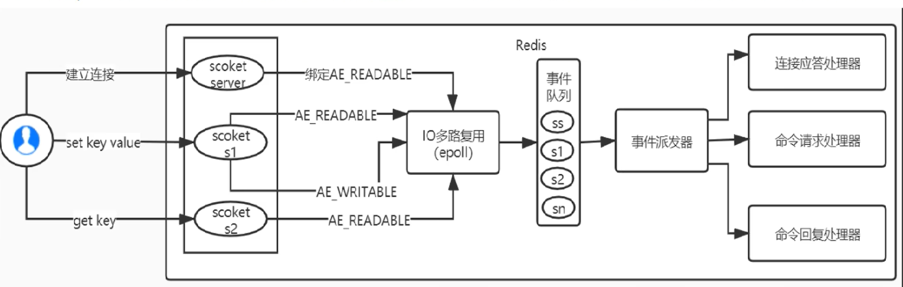

# 多路复用要解决的问题
  并发多客户端连接的场景下,再多路复用之前最简单和典型的方案就是: 同步阻塞网络IO模型,这种模式的特点就是用一个进程来处理一个网络连接(用户请求),那这种方式的性能是非常差的;
为了高效地对海量用户提供服务,必须要让一个进程能同时处理很多个tcp连接才行,那么假设现在一个进程保持了10000条连接,那么如何发现哪条连接上有数据可读了、哪条连接可写了？
  我们当然可以用循环遍历的方式来发现IO事件,但这种方式太低级了,我们希望有一种更高效的机制,在很多连接中的某条上有IO事件发生时,快速将其找出;
  其实这个事情Linux操作系统已经替我们做好了,它就是我们熟知的IO多路复用机制,这里的复用指的是对进程的复用
  总结一下多路复用的要解决的问题:
  - 一个进程来处理多个网络连接(用户请求),即对进程的复用
  - 纳入管理的多条tcp连接在有事件发生时,会主动通知进程

# 多路复用的实现
  可以分为 select -> poll -> epoll 三个阶段来描述
  
# redis的多路复用
  redis利用epoll来实现多路复用,将连接信息和事件放到队列中,一次放到文件事件分派器,事件分派器将事件分发给事件处理器,
  所谓IO多路复用机制,就是说通过一种机制,可以监视多个描述符,一旦某个描述符就绪(一般是读就绪或写就绪),能够通知程序进行相应的读写操作,这种机制的使用需要select、
poll、epoll来配合;多个连接共用一个阻塞对象,应用程序只需要在一个阻塞对象上等待,无需阻塞等待所有连接,当某条连接有新数据可以处理时,操作系统会通知应用程序,线程
从阻塞状态返回,开始进行业务处理
  redis服务采用Reactor的方式来实现文件事件处理器(每一个网络连接其实都对应一个文件描述符),redis基于Reactor模式开发了网络事件处理器,这个处理器被称为文件事件
处理器,它由四部分组成:多个套接字、IO多路复用程序、文件事件分派器、事件处理器;因为文件事件分派器队列的消费是单线程的,所以redis才叫单线程模型;
  redis基于Reactor模式开发了自己的网络事件处理器,这个处理器又被称为文件事件处理器:
  - 文件事件处理器使用IO多路复用程序来同时监听多个套接字,并根据套接字目前执行的任务来为套接字关联不同的事件处理器
  - 当被监听的套接字准备好执行连接应答、读取、写入、关闭等操作时,与操作相对应的文件事件就会产生,这时文件事件处理器就会调用套接字之前关联好的事件处理器来处理这些事件
  虽然文件事件处理器以单线程方式运行,但通过使用IO多路复用程序来监听多个套接字,文件事件处理器既实现了高性能的网络通信模型,又可以很好地与Redis服务器中其他同样以单线程
  方式运行的模块进行对接,这保持了Redis内部单线程设计的简单性;