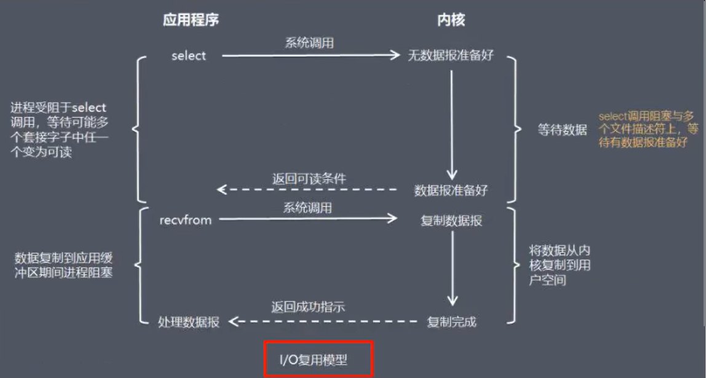

# Unix网络编程中的五种IO模型
  - Blocking IO - 阻塞IO
  - NoneBlocking IO - 非阻塞IO
  - IO multiplexing - IO多路复用
  - signal driven IO - 信号驱动IO
  - asynchronous IO - 异步IO
  我们只学习前三种,后两种面试不考,暂时不深入学习

# BIO
  BIO首先在连接这一步就存在阻塞,BIO中的server会始终阻塞着去监听是否有client前来连接,即使client长时间没有连接,但是server依然会保持阻塞状态;(这点就类似饭店, 
要在一整天啊始终保持着在柜台前等候客户的状态,即使一天没来客户,也依然要始终保持自己在柜台前,以便客户到来的第一时间进行接待);
[Code案例:RedisServer、RedisClient01、RedisClient02](/src/main/java/bio/accept)
  接下来BIO还会在read()读取方法上阻塞,这就更加严重了,[Code案例:](/src/main/java/bio/read),这里我们启动server后,先通过client1进行写消息,写两条,再通过client2
写消息,也写两条,这时你会发现,server只处理了先来的client1的消息,而无视了client2的消息,并且client1如果继续写消息,依然可以读取,而client2因为来晚了,始终阻塞着,只有
当client1结束,server端才会处理client2的消息,并且可以通过输出发现,当client1结束时,server端会一次性接收到client2被阻塞的多条消息;
  为了解决多客户端在read()时阻塞的问题,我们尝试在处理read()方法时,采取多线程的方案,每来一个新的客户端连接,accept的阻塞不可避免,但是read()处理时每一次都开辟新线程,
即使阻塞也是在一个子线程阻塞,而不会影响主线程继续跟其他客户端建立连接,[Code案例:](/src/main/java/bio/read/multiThread)  
  但是,在我们的实际生产开发中,百万级的并发也是存在的,那么百万级的并发去新建百万级的线程是不现实的,所以我们还需要继续优化,线程池虽然可以通过池化来降低线程上下文切换的消耗,
但对于百万级的数据量,其实线程池也面对着大小设置的问题,并且过大的数据量可能线程池本身也无法支持,所以我们的优化方向只剩下一个:如果read()方法不阻塞,就无需多个线程了,这就用到
了另一个IO模型,NIO(非阻塞式IO)  
  
  总结一下BIO,对于accept接收客户端连接和read接收客户端消息,这两块,BIO都会阻塞(简单说就是一个客户端只要开始操作,其他客户端过来就阻塞),并且在高并发的场景下,read()方法的阻塞 
造成的影响非常大,tomcat7之前是用BIO多线程来解决多连接场景下read()阻塞的问题;

# NIO
  当用户进程发出read操作时,如果内核中的数据还没有准备好,那么它并不会阻塞用户进程,而是立刻返回一个error;从用户进程角度讲,它发起一个read操作后,并不需要等待,而是马上就得到了结果;
用户进程判断结果是一个error时,它就知道数据还没有准备好,于是它可以再次发送read操作;一旦内核中的数据准备好了,并且又再次收到了用户进程的调用,那么它马上就将数据拷贝到了用户内存,
然后返回;
  所以,NIO的特点是用户进程需要不断的主动询问内核数据准备好了吗？一句话,用轮询替代阻塞！[Code案例:](/src/main/java/nio)
  
  # NIO面试回答
  在NIO模式中,一切都是非阻塞的;(socket通过read()方法读取数据这一步是阻塞的)
  accept()方法是非阻塞的,如果没有客户端连接,就返回无连接标识
  read()方法是非阻塞的,如果read()方法读取不到数据就返回空闲中标识,如果读取到数据时,就返回read()读取到的数据,需要注意这里会阻塞,阻塞事件即为read()方法读数据的时间
  在NIO模式中,只有一个线程;当一个客户端和服务端进行连接,这个socket就会加入到一个数组中,隔一段时间遍历一次,看这个socket的read()方法能否读取到数据,这样一个线程就能处理
多个客户端的连接和读取了;
  
  # NIO存在的问题和的优缺点
  NIO成功的解决了BIO需要开启多线程来应对多个客户端read的问题,NIO中一个线程就能解决多个socket,但是NIO还存在2个问题
  - 如果我们现在有10000个连接存在了我们的容器中,那我们需要对这10000个链接进行遍历,看其中哪个socket有数据,那如果现在只有2个socket有数据,那么对其他9998个链接的判断,都是无用功,
  每次 int read = element.read(byteBuffer),结果返回-1仍然是一次对资源的浪费
  - 这个遍历过程是在用户态进行的,用户态判断socket是否有数据还是调用内核的read()方法实现的,这就涉及到用户态和内核态的切换,每遍历一个就要切换一次,开销很大

  优点: 不会阻塞在内核的等待数据过程,每次发起的IO请求可以立即返回,不用阻塞等待,实时性较好;
  缺点: 轮询将会不断的询问内核,这将占用大量的CPU时间,系统资源利用率低,所以一般web服务器不使用这种IO模型
  结论: 如果我们可以让Linux内核搞定上述需求,即我们将一批文件描述符通过一次系统调用传给内核由内核层去遍历,这不就解决了用户态和内核态频繁切换造成性能开销的问题了！多路复用应运而生,
     也就是说,将上述的工作直接放入Linux内核,不再两态转换,而是直接从内核获取结果,因为内核是非阻塞的

# IO多路复用
  FileDescriptor,简写FD
  文件描述符FD是计算机科学中的一个术语,是一个用于表述指向文件的引用的抽象化概念;文件描述符在形式上是一个非负整数,实际上,它是一个索引值,指向内核为每一个进程所维护的该进程打开文件的
记录表;当程序打开一个现有文件或者创建一个新文件时,内核向进程返回一个文件描述符;在程序设计中,一些涉及底层的程序编写往往会围绕着文件描述符展开,但是文件描述符这一概念往往只适用于UNIX、
LINUX这样的操作系统

  
  IO multiplexing就是我们说的select、poll、epoll,有些技术书籍也称这种IO方式为: event driven IO即事件驱动IO;就是通过一种机制,一个进程可以监视多个描述符,一旦某个描述符就绪
(一般是读就绪或者写就绪),能够通知程序进行相应的读写操作;可以基于一个阻塞对象并同时在多个描述符上等待就绪,而不是使用多个线程(每个文件描述符一个线程,每次new一个线程),这样可以大大节省
系统资源;所以,IO多路复用的特点是: 通过一种机制一个进程能同时等待多个文件描述符,而这些文件描述符(套接字描述符)其中的任意一个进入读就绪状态,select、poll、epoll等函数就可以返回;
  其实就是将我们在案例[Code案例:](/src/main/java/nio)中做的事情放到了内核态中,让内核态来遍历,这样每一次对socket的遍历就变成了内核态中对文件描述符的遍历,这就大大减少了用户态
到内核态的切换所消耗的资源,而select、poll、epoll就是linux为我们提供的一个类似于java中封装函数的IO多路复用函数  