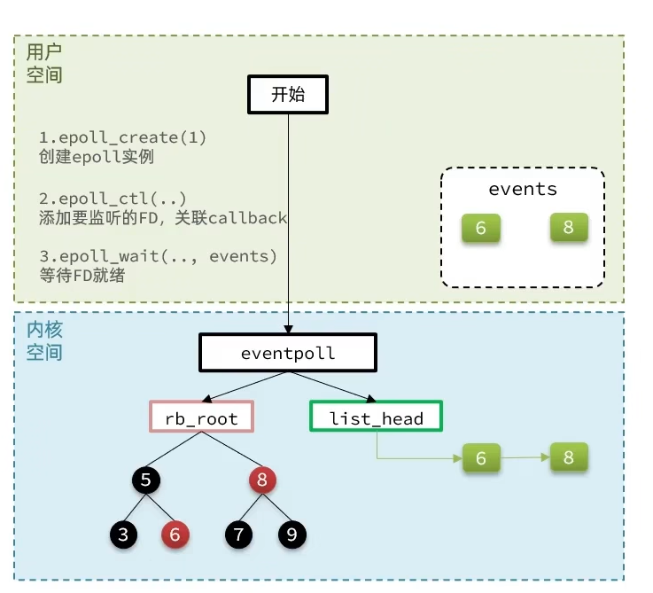

# epoll模式
  epoll模式是对select和poll的改进,它提供了三个函数:
  
  - 函数一
  int epoll_create(int size) //执行该函数时,会在内核创建eventpoll结构体,返回对应的句柄epfd
  
  struct eventpoll {
    struct rb_root rbr;  // 一棵红黑树,记录要监听的FD
    struct list_head rdlist;  // 一个链表,记录就绪的FD
  }

  - 函数二
  int epoll_ctl( // 执行该函数时,会将一个FD添加到epoll的红黑树中,注意,这个方法只负责添加,而不负责监听
    int epfd, // epoll实例的唯一标识
    int op, //要执行的操作,包括: ADD、MOD、DEL,这里的增删改指的是要把FD增加到一个红黑树、删除红黑树中的FD、修改红黑树中某个FD监听的事件类型
    int fd, //要监听的FD
    struct epoll_event *event //要监听的事件类型: 读、写、异常等
  )

  - 函数三
  int epoll_wait(  // 检查rdlist列表是否为空,不为空则返回就绪的FD的数量
    int epfd, //eventpoll唯一标识
    struct epoll_event *events, //空event数组,用于接受就绪的fd
    int maxeventss, events数组的最大长度
    int timeout //超时时间
  )

  # epoll模式交互逻辑
  
  - [用户空间]调用epoll_create(1),创建出一个eventpoll实例,并返回一个唯一标识epfd(一个eventpoll只有一个唯一标识epfd)给回到用户空间 
  - [用户空间]调用epoll_ctl(epfd, ADD, fd, read), 这时会将FD由用户态拷贝至内核态,在内核态中讲该FD添加到epfd对应的eventpoll的红黑树上,并设置一个关联的callback回调;
  - [用户空间]调用epoll_wait()后就是一个等待状态,如果有FD的callback回调触发,就会将该FD添加到reList就绪列表中,而一旦rdlist不为空,epoll_wait方法就会将就绪FD的数量返回,
  并且,内核空间中,该epfd对应的eventpoll的rdlist会被由内核态拷贝至用户态
  至此,完成epoll函数对fd监听的全部动作

  # 相比于select和poll模式,epoll模式做了哪些改进使得性能大幅提升？
  - 首先是epoll模式下最终复制到用户空间的rdlist里存放的全都是就绪fd,直接用即可,不需要像select和poll模式,还要通过遍历才能知道哪些是就绪fd;此外,因为未就绪的fd不会进行这一次复制,在数据量非常大的
  情况下,如果10000个fd只有1个就绪,那么epoll模式复制的relist的长度是1,而select模式复制的list的长度是10000,这个环节的性能也获得了提升;
  - epoll底层用红黑树监听fd,select用1024个bit位监听fd,poll用list监听fd,不难发现,epoll不但对fd的数量没有限制,并且因为红黑树的结构,使得即使fd数量级非常大,也不会对增删改查的效率有什么影响,
  而list就不同了,数量级极大时list的遍历的消耗也远大于红黑树
  - select()方法干了两件事,一是将需要监听的fd加入数组,将数组拷贝至内核空间,二是在内核空间中监控fd数组,一旦有fd就绪,将整个fd数组拷贝回用户空间;
    epoll很聪明的很聪明的一点是将这两件事拆成了两步,但是效率却增加非常多,我们来用例子解释
    - 第一次来了3个fd, 1 2 3
      select: 123全部加入数组[1,2,3],拷贝至内核,过一会1就绪了,ok那么返回;
      epoll: 123分别调用epoll_ctl,将其加到红黑树中,设置回调,在调用epoll_wait开始等待;过一会1就绪了,ok返回;
    - 第二次来了5个fd,4 5 6 7 8
      select: 现在有2 3 4 5 6 7 8这些fd,ok,加入到数组[2,3,4,5,6,7,8],拷贝至内核,过一会2就绪了,ok那么返回
      epoll: 2和3已经在我们内核的红黑树上了,分别把4,5,6,7,8加入到红黑树,设置回调,等待;过一会2就绪了,ok那么返回;
    - 第三次来了9,10两个fd
      select: 现在有3 4 5 6 7 8 9 10这些fd,ok,加入到数组[3,4,5,6,7,8,9,10],拷贝至内核,过一会3就绪了,ok那么返回
      epoll: 只有9,10不在我们红黑树上,分别把9,10加入红黑树,设置回调,等待;过一会3就绪了,ok那么返回
    好了,可以发现,对于fd=3,这个fd在select中复制了3次,但是在epoll中只复制了1次,即对于select来说,一个fd只要不就绪,且一直有新fd进来的情况下,它会被反复由用户态拷贝至内核态,但epoll保证每个fd只会被拷贝一次,
  如果像3这样的fd的数量级越大,epoll相比于select提升的效率就越多

